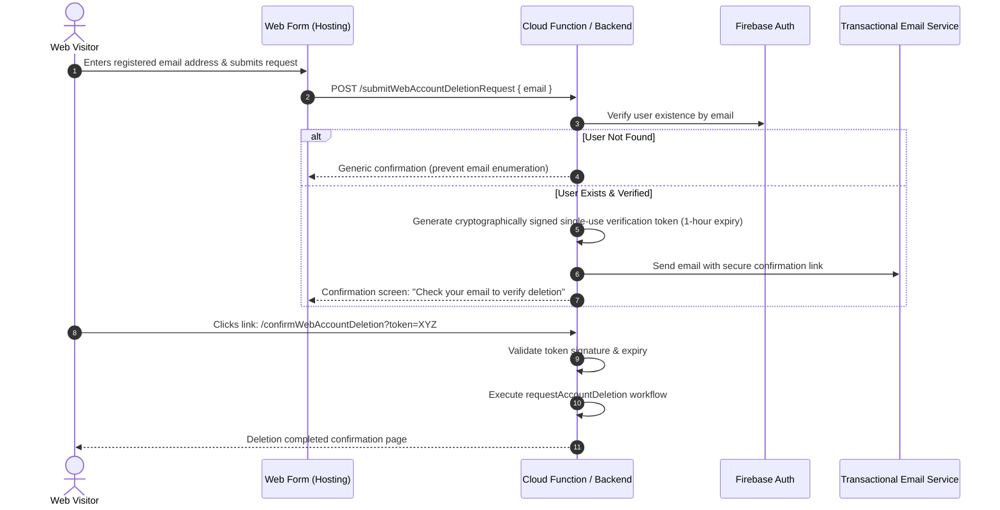

# Google Play Web Account Deletion Contract & Specification

## 1. Regulatory & Google Play Requirement Overview
Google Play Developer Policy requires all applications that allow users to create an account within the app to provide:
1. An **in-app account deletion path** (implemented via the mobile app settings).
2. A **publicly accessible web-based deletion request URL** where users can request deletion of their account and associated data without reinstalling the app.

> **Founder / Domain Notice**:
> No public domain (such as `paperroute.in`) is assumed to be active or owned prior to founder authorization. The public URL configured in the Google Play Console can point to a standard Firebase Hosting URL (e.g. `https://paperroute-production.web.app/delete-account` or `https://paperroute.in/delete-account` once DNS is mapped).

---

## 2. Public Web Deletion Request Interface
The public web page must provide a simple, secure, mobile-friendly form accessible to any browser.

### Public Form Elements:
1. **User Identity Input**:
   - Registered Email Address (Required)
   - Account Role / Agency Name (Optional helper for lookup)
   - Reason for Deletion (Optional)
2. **Clear Legal & Retention Notice**:
   - Informs the user of what will be deleted, what will be anonymized, and what statutory financial records must be retained.
3. **Verification Method Selection**:
   - Email verification link (default for unauthenticated web visitors).

---

## 3. Anti-Abuse & Identity Verification Workflow
To prevent malicious third parties from requesting deletion of another user's account, web-submitted deletion requests cannot execute immediately without verified proof of account ownership.

### Verification Flow:

---

## 4. Server Execution Rules by Role

### A. Employee Account Deletion
1. Operational membership status in `businesses/{businessId}/members/{uid}` is transitioned to `removed`.
2. Personal contact fields (`displayName`, `email`, `phone`, `permissions`, `areaIds`) are redacted and replaced with anonymized placeholders (`Former Employee`, `deleted-<hash>@deleted.paperroute.local`).
3. Personal user profile in `userProfiles/{uid}` is updated to `status: "deleted"` and contact info wiped.
4. Historical financial payments where `collectorUid == uid` are **strictly retained** to preserve cash accounting balances.
5. Firebase Auth identity is deleted via `getAuth().deleteUser(uid)`.

### B. Agency Head / Owner Account Deletion
1. **Active Operations Safeguard**: The system verifies whether the agency has:
   - Active employees (`members` with `status == 'active'` and `role == 'employee'`).
   - Active customers (`customers` with `archived == false`).
2. If active employees or customers exist:
   - The deletion request is marked `blocked_active_operations`.
   - An email is sent to the owner explaining that active routes must be archived and employees removed before the agency can be permanently closed.
3. If all customers are archived and all employees removed:
   - The agency record in `businesses/{businessId}` is transitioned to `status: "closed"`.
   - The owner's member and profile documents are anonymized.
   - The owner's Firebase Auth identity is deleted.
   - Historical bills, payments, and audit records remain preserved in Firestore for statutory compliance.

---

## 5. Complete Data Retention & Anonymization Matrix

| Data Category | Storage Location | Action on Deletion | Technical & Operational Rationale |
| :--- | :--- | :--- | :--- |
| **Auth Credentials** | Firebase Authentication (`auth.users`) | **DELETED** | Permanently destroys identity, password hashes, and tokens. Prevents sign-in and token issuance. |
| **User Profile Document** | `/userProfiles/{uid}` | **ANONYMIZED** | Removes name, phone, and email. Preserves document shell with status `deleted` for lookup integrity. |
| **Agency Ownership** | `/agencyOwners/{uid}` | **ANONYMIZED & CLOSED** | Status updated to `closed`, contact email replaced with anonymized placeholder. |
| **User Consents** | `/userConsents/{uid}/acceptances/*` | **RETAINED** | Immutable record of Terms & Privacy version acceptance. Contains zero personal contact details (no name/phone/email). |
| **Provisioning Controls** | `/agencyProvisioningControls/{uid}` | **RETAINED** | Rate limiting and anti-abuse cooldown counters. Contains no personal contact data. |
| **Workspace Membership** | `/businesses/{bizId}/members/{uid}` | **ANONYMIZED & REVOKED** | Status set to `removed` or `closed`, permissions and area assignments wiped, contact fields replaced with placeholders. |
| **Business Agency Record** | `/businesses/{bizId}` | **RETAINED (CLOSED)** | Agency status set to `closed`, personal phone cleared. Business entity record retained for historical bills. |
| **Employee Invitations** | `/businesses/{bizId}/invitations/*` | **REVOKED / HISTORICAL** | Pending invitations to closed agency are automatically revoked. Past accepted invitations remain audit history. |
| **Payment Ledger & Collector Refs** | `/businesses/{bizId}/customers/{cId}/payments/*` | **RETAINED (IMMUTABLE)** | Immutable financial accounting records. Collector UID foreign key is retained without alteration. |
| **Payment Reversals** | `/businesses/{bizId}/customers/{cId}/reversals/*` | **RETAINED (IMMUTABLE)** | Immutable ledger reversal records. Reversal actor UID retained for financial audit trail. |
| **Invoices & Bill Allocations** | `/businesses/{bizId}/customers/{cId}/bills/*` | **RETAINED (IMMUTABLE)** | Commercial tax invoices and daily subscription allocations. |
| **System Audit Logs** | `/businesses/{bizId}/auditRecords/*` | **RETAINED (IMMUTABLE)** | Append-only audit integrity. Final deletion event is appended to the log. |
| **Deletion Request Records** | `/accountDeletionRequests/{uid}` | **CREATED / RETAINED** | Immutable compliance audit record proving deletion was requested and executed. User can read own record (`get` only). |

---

## 6. Google Play Console Configuration
When publishing on the Google Play Console:
- Navigate to **Policy and programs** > **App content** > **Account deletion**.
- Answer: *"Does your app allow users to create an account?"* -> **Yes**.
- Answer: *"Do you provide a link for users to request deletion of their account?"* -> **Yes**.
- Enter URL: `https://<approved-domain>/delete-account` (or Firebase Hosting URL).
- Answer: *"Does your app delete all data requested by the user, or retain some data for legitimate reasons?"* -> **Retain some data**.
- Specify retained data categories: **Financial transaction history and billing audit records retained for statutory commercial accounting and tax compliance.**
